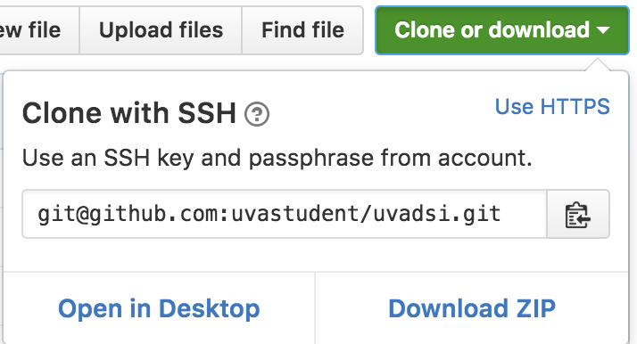

# Contributing to the `uvadsi` package

Thanks for looking to contribute!

## Process

Check out a [walkthrough below](#walkthrough). For all the wonderful details, check out [R packages by Hadley Wickham](http://r-pkgs.had.co.nz/).

The rough process to contribute to this package (and most open source github repositories) is to:

 * Fork the project
 * Clone locally and create a Feature Branch
 * Make commits (ie, add a new function)
 * Push to your fork
 * Make a pull request back to the original and get it approved.

That's it! Don't forget to add yourself as an author to the `DESCRIPTION` file!

## Requirements

But life can't be all fun and games. A new feature must satisfy a few requirements:

 * Have new code (or data)
 * Proper documentation (roxygen2 comments)
 * Passing test suite with adequate coverage
 * Clean `lintr::lint_package()` and `devtools::check()`

Bug fixes have a similar path. Optionally include a vignette for your code.

## Style

This package will largely follow standard R style found in `lintr` and `formatR`, however the default indentation is 2 spaces. You may use the automation with a command such as `formatR::tidy_dir("./R", indent=2)`

## Tools

To work on a package, you will need the following R packages:

 * `devtools`
 * `testthat`
 * `covr`
 * `lintr`

You can install them by hand or run the following lines once:

```R
if (!require("devtools")) install.packages("devtools")
if (!require("testthat")) install.packages("testthat")
if (!require("covr")) devtools::install_github("jimhester/covr")
if (!require("lintr")) devtools::install_github("jimhester/lintr")
```

# Walkthrough

Step by step, how to contribute a function.

### Step 1 - Fork the Project

Visit [https://github.com/user01/uvadsi](https://github.com/user01/uvadsi) and click the "Fork" button in the upper right.


### Step 2 - Clone your Fork

You now have a personal copy of `uvadsi` in your github account. Clone that to your local machine (bring the remote copy on to your computer).

Find a directory where you want to work (for example `~/code/r/`), navigate there, and clone your fork. You can find the url under the green Clone/Download button.




```bash
git clone git@github.com:uvastudent/uvadsi.git
```

You will end up with a new folder containing the repository of the uvadsi package. As per the example, this would be at `~/code/r/uvadsi`.

### Step 3 - Make a Feature Branch

Create a [branch](https://www.atlassian.com/git/tutorials/using-branches) for your new feature. Name this in some way meaningful to your work, such as `cool-new-feature`.

```bash
git checkout -b cool-new-feature
```

### Step 4 - Write Code

Write your code and commit often with helpful messages. [Skip to Checking](#step-6---check-code).

If using RStudio, you can open the `uvadsi.Rproj` and take advantage of the GUI.

All R code goes in the `./R/` folder. Unless you have a fantastic reason otherwise, create a new file called `./R/cool_new_feature_functions.R`. This will contain your working code.

Develop as normal from here. The [packages book](http://r-pkgs.had.co.nz/) goes into more details, but you expose functions by tagging them with special comments. When developing, load libraries into the environment with `library()` without putting that call in the package code. If you need more libraries, be prepared to argue for them and add them to the uvadsi package. See the existing files for templates.

In this example's `./R/even_or_odd_functions.R`, we will use the following code:

```R
even_count_of_elements <- function(v) {
  (length(v) %% 2) == 0
}

even_or_odd <- function(v){
  if (even_count_of_elements(v)) {
    return("Even")
  }
  if (sum(v %% 2== 0) > 1) {
    return("Even")
  }
  return("Odd")
}
```

This example is (quite) contrived, but will suffice for examples. In particular, the function we want to offer is `even_or_odd`. `even_count_of_elements` is just an internal helper.

### Step 5 - Document Code

Once written, the code must be documented. This is how future developers know what your code does, how RStudio produces help pages, and how this package builds the user manual.

This roxygen2 style of comments is covered in more depth [online](http://r-pkgs.had.co.nz/man.html). Notable is the `#' @export` line, which marks this as an external function for the package. The `#' @examples` will be tested as real code.

This will be exercised in the subsequent sections. For now, just write what you think is helpful to know.

```R
#' Checks if the number of elements in a vector is even or not
#'
#' @param v Vector of any type
#' @return logical TRUE if the vector has an Even length, FALSE otherwise
even_count_of_elements <- function(v) {
  (length(v) %% 2) == 0
}

#' Marks a numeric vector as either Even or Odd
#'
#' If the vector has an even number of elements, then it is always "Even"
#' If the vector has an odd number of elements, but any of them are even
#'  then the result is "Even"
#' Otherwise, the result is "Odd"
#'
#' @param v Vector of numeric type
#' @return character Either "Even" or "Odd"
#' @examples
#' even_or_odd(1:4)
#' even_or_odd(1:3)
#' even_or_odd(1:5)
#' even_or_odd(2:4)
#' even_or_odd(2)
#' @export
even_or_odd <- function(v){
  if (even_count_of_elements(v)) {
    return("Even")
  }
  if (sum(v %% 2== 0) > 1) {
    return("Even")
  }
  return("Odd")
}
```

When satisfied, run `devtools::document()` from the R console. R will build the
appropriate help documentation.

### Step 6 - Test Code

All code accepted to this package must have good **test coverage** (check that functions work as desired) and complete **code coverage** (all lines are checked). Both will be done in one step.

Tests are written in with the `testthat` library. Create a new file in the `./tests/testthat/` with an appropriate name. It must start with "test_", as in `test_even_or_odd_functions.R`.

Testing is a topic deserving of it's [own chapter](http://r-pkgs.had.co.nz/tests.html), but in short it provides deterministic checks that code is performing as expected. They are organized into test blocks, which can be divided up into like groups.

Blocks set up the environment to test your function, exercise them, and check the results match the expected. Sounds complicated, but it's just a formalized process for what you do when you try your work on the console.

```R
test_that("even tests", {
  # 1 2 3 4 has 4 elements, must be even
  even_or_odd(1:4) %>%
    expect_equal("Even")
})
```

Run these tests in the console with `devtools::test()`.

```R
> devtools::test()
Loading uvadsi
Testing uvadsi
...............................................................................
......................................................
DONE ===========================================================================
```

All green, so all the tests passed! But we still need to check for code
coverage. Do so with `covr::package_coverage()`.

```
uvadsi Coverage: 96.04%
R/even_or_odd_functions.R: 50.00%
R/combo_functions.R: 100.00%
R/matrix_functions.R: 100.00%
R/residuals_functions.R: 100.00%
R/utility_functions.R: 100.00%
R/vif_lm.R: 100.00%
```

Note the less than 100% coverage on the new `even_or_odd_functions.R`. That
means not all of the code we wrote is being tested at all (nevermind you
probably saw how incomplete the tests were yourself).

Check for which lines are uncovered with
`covr::zero_coverage(covr::package_coverage())`

```
                    filename   functions line value
32 R/even_or_odd_functions.R even_or_odd   30     0
34 R/even_or_odd_functions.R even_or_odd   31     0
37 R/even_or_odd_functions.R even_or_odd   32     0
41 R/even_or_odd_functions.R even_or_odd   33     0
```

Not shockingly, the tests never run any code after the first if statement.

A better test suite would be:

```R

# #############################################################################
# even_or_odd Tests
# #############################################################################
test_that("even tests", {

  # 1 2 3 4 has 4 elements, must be even
  even_or_odd(1:4) %>%
    expect_equal("Even")

  # 1 2 3 has 3 elements, but one even number, so this is also even
  even_or_odd(1:3) %>%
    expect_equal("Even")

  # 1 2 3 4 5 has 5 elements, but both 2 and 4 are even, so this is even
  even_or_odd(1:5) %>%
    expect_equal("Even")

  # 2 3 4 has 3 elements, but both 2 and 4 are even, so this is even
  even_or_odd(2:4) %>%
    expect_equal("Even")

})

test_that("odd tests", {
  # 1 has only 1 element and no even elements, so this should be odd
  even_or_odd(1) %>%
    expect_equal("Odd")
})
```

Another `devtools::test()` gives:

```
........................................1.......................................
.........................................................
Failed -------------------------------------------------------------------------
1. Failure: even tests (@test_even_or_odd_functions.R#12) ----------------------
`_lhs` not equal to "Even".
1/1 mismatches
x[1]: "Odd"
y[1]: "Even"
```

Unfortunate. The test for `1:3` is being called even, but it should be odd.
Since our (peculiar) logic for this function is correct (it _should_ be even),
checking the code shows a typo.

```R
if (sum(v %% 2== 0) > 1) {
```

should be

```R
if (sum(v %% 2 == 0) > 0) {
```

One more `devtools::test()` gives:

```
> devtools::test()
Loading uvadsi
Testing uvadsi
................................................................................
.........................................................
DONE ===========================================================================
>
```

All the tests pass. And `covr::package_coverage()`:

```
> covr::package_coverage()
uvadsi Coverage: 100.00%
R/combo_functions.R: 100.00%
R/even_or_odd_functions.R: 100.00%
R/matrix_functions.R: 100.00%
R/residuals_functions.R: 100.00%
R/utility_functions.R: 100.00%
R/vif_lm.R: 100.00%
```

All tested (barely, this is an extremely minimal test suite for a demo) and the
code is covered.

### Step 7 - Check Code

Checking vs Testing? Testing ensures code works as it should, checking ensures
code matches the style as it should.

For contributors, the biggest hurdle is typically
[linting](http://stackoverflow.com/questions/8503559/what-is-linting). Lint the
existing code with the `lintr` package with the following command:

```R
lintr::lint_package(linters=lintr::default_linters[names(lintr::default_linters) != "object_usage_linter"])
```

(Why the ugly subsetting? There is a
[bug in lintr](https://github.com/jimhester/lintr/issues/27). This just removes
that tester from throwing unwarranted complaints.)

The results are:

```
> lintr::lint_package(linters=lintr::default_linters[names(lintr::default_linters) != "object_usage_linter"])
.............
R/even_or_odd_functions.R:30:17: style: Put spaces around all infix operators.
  if (sum(v %% 2== 0) > 0) {
               ~^
```

The issues tend to be self explanatory, fix them as noted. They maintain style
and clarity through the code base.

You may get a _lot_ of notes, but that doesn't mean the code is bad or even that
many issues. `lintr` tags each and every character out of place. Just polish
everything to satisfy the linter.

Add the required space results in:

```
> lintr::lint_package(linters=lintr::default_linters[names(lintr::default_linters) != "object_usage_linter"])
.............
```

And last perform a full devtools check. This ensures the package is as clean and
ready to install as when you started. Checks for stray files or bad
configurations.

```
> devtools::check()
<Lots of output ... >
Status: OK

R CMD check results
0 errors | 0 warnings | 0 notes
```

The output is long, so I won't reproduce it here. If there are any errors,
warnings, or notes, you must address them before submitting. If nothing has been
moved with stray files or new dependencies, this should be a formality.
