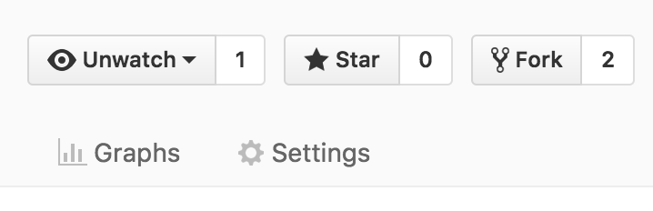

# Contributing to the `uvadsi` package

Thanks for looking to contribute!

## Process

Check out a [walkthrough below](#walkthrough). For all the wonderful details, check out [R packages by Hadley Wickham](http://r-pkgs.had.co.nz/).

The rough process to contribute to this package (and most open source github repositories) is to:

 * Fork the project
 * Clone locally and create a Feature Branch
 * Make commits (ie, add a new function)
 * Push to your fork
 * Make a pull request back to the original and get it approved.

That's it! Don't forget to add yourself as an author to the `DESCRIPTION` file!

## Requirements

But life can't be all fun and games. A new feature must satisfy a few requirements:

 * Have new code (or data)
 * Proper documentation (roxygen2 comments)
 * Passing test suite with adequate coverage
 * Clean `lintr::lint_package()` and `devtools::check()`

Bug fixes have a similar path. Optionally include a vignette for your code.

## Style

This package will largely follow standard R style found in `lintr` and `formatR`, however the default indentation is 2 spaces. You may use the automation with a command such as `formatR::tidy_dir("./R", indent=2)`

# Walkthrough

Step by step, how to contribute a function.

### Step 1 - Fork the Project

Visit [https://github.com/user01/uvadsi](https://github.com/user01/uvadsi) and click the "Fork" button in the upper right.

